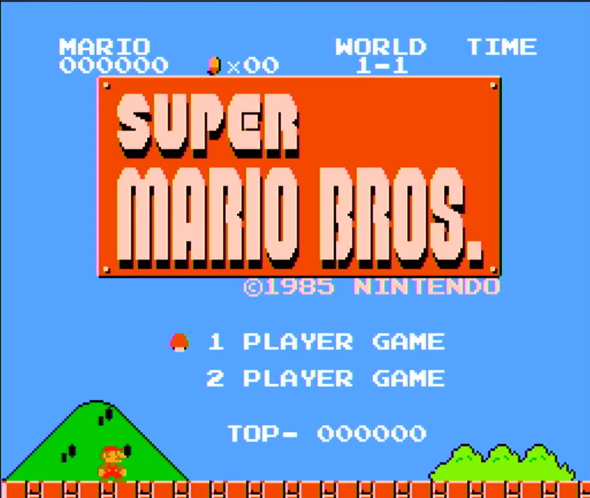

# NESV

**NESV** (NES in SystemVerilog) is an NES emulator built entirely in SystemVerilog using Vivado. It targets the Xilinx Spartan-7 XC7S50-CSGA324 FPGA (Urbana board) and was developed as the final project for **ECE 385** at the University of Illinois.

## Features

- Supports all **Mapper 0** (NROM) NES games  
- **Two-player controller support** via USB keyboard input, implemented over SPI  
- **HDMI output** at 640×480 @ 60 FPS

